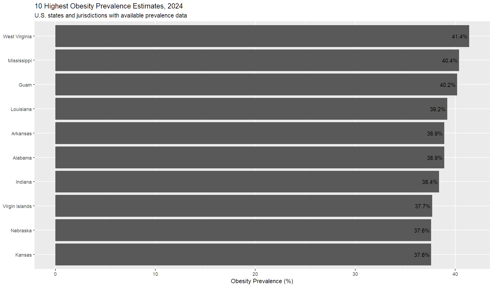

# Adult Obesity Prevalence Across U.S. States and Jurisdictions — 2024

## Project Overview

This project explores adult obesity prevalence estimates across U.S. states and jurisdictions using publicly available data from the Centers for Disease Control and Prevention (CDC).

The analysis was completed in R as part of my public health data portfolio and focuses on practicing data cleaning, descriptive analysis, data visualization, and interpretation of population health data.

## Research Question

How does adult obesity prevalence vary across U.S. states and jurisdictions with available 2024 data?

## Data Source

Centers for Disease Control and Prevention (CDC), Behavioral Risk Factor Surveillance System (BRFSS).

The dataset contains 2024 adult obesity prevalence estimates and 95% confidence intervals for U.S. states and jurisdictions. One jurisdiction had insufficient data and was excluded from calculations requiring numeric prevalence values.

## Methods

Using R and RStudio, I:

- Imported and reviewed the CDC dataset.
- Identified and handled a non-numeric "Insufficient data" value.
- Created a numeric prevalence variable for analysis.
- Calculated descriptive statistics.
- Identified jurisdictions with the lowest and highest prevalence estimates.
- Ranked available prevalence estimates.
- Created a visualization of the 10 highest estimates using ggplot2.

## Key Findings

Among jurisdictions with available data:

- Mean obesity prevalence: **34.0%**
- Median obesity prevalence: **34.2%**
- Lowest estimate: **Colorado — 25.0%**
- Highest estimate: **West Virginia — 41.4%**
- One jurisdiction, Tennessee, had insufficient prevalence data and was excluded from numeric calculations.

## Visualization

The visualization shows the 10 highest adult obesity prevalence estimates among the states and jurisdictions with available 2024 data.

## Tools Used

- R
- RStudio
- ggplot2
- Git
- GitHub

## Limitations

This is a descriptive analysis of prevalence estimates and does not establish why obesity prevalence differs between jurisdictions. Estimates should also be interpreted in the context of the survey methodology and their reported confidence intervals.

## Project Status

**Completed — September 2026**
