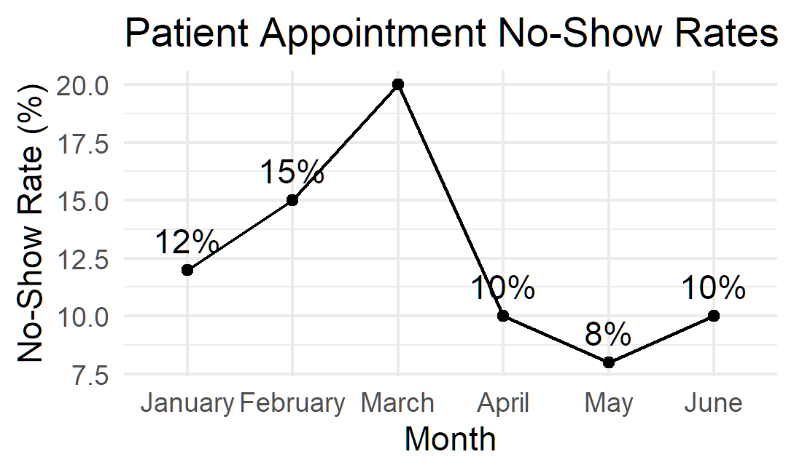

# Analysis of No-Show Patient Appointments

## Project Overview

In this project, I analyzed patient appointment no-show rates from January through June to identify which months had the highest and lowest rates of missed appointments. This type of analysis can help identify patterns that may warrant further investigation and guide efforts to understand potential causes and opportunities for improvement.

## Research Question

Which month had the highest patient appointment no-show rate, and which month had the lowest?

## Data Source

This project uses a fictional dataset created for educational and practice purposes. The dataset includes monthly appointment totals and no-show counts from January through June. No real patient information or protected health information (PHI) is included.

## Methods
First, I calculated the no-show rate for each month using the number of no-shows and the total number of appointments.
Then, I calculated the average no-show rate and identified the months with the highest and lowest no-show rates.
## Key Findings
The highest no-show rate occurred in March at 20%.
The lowest no-show rate occurred in May at 8%.
The average no-show rate across the six-month period was 12.5%.
Finally, I created a line graph to visualize how the no-show rates changed from January through June.
## Visualization

## Tools Used

- R
- RStudio
- ggplot2
- Git
- GitHub
## Limitations

This project uses a small fictional dataset covering only six months. The analysis is descriptive and can identify patterns in no-show rates, but it cannot determine why patients missed their appointments. Additional data would be needed to investigate potential causes.
## Project Status

Completed — October 2026